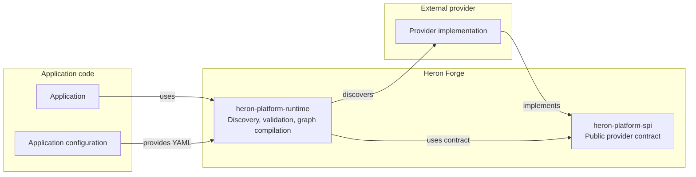
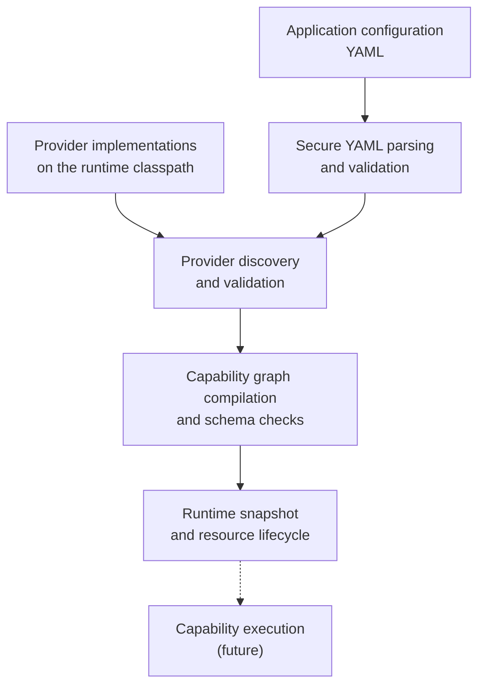

# Heron Forge

Heron Forge is a Java platform for building, discovering, validating, and composing provider-based capabilities.

Providers expose capabilities through an SPI. 
The runtime loads providers, validates application configuration and capability graphs, checks schemas and dependencies and prepares immutable runtime snapshots.

### Architecture



### Runtime flow



The project provides a framework-independent SPI/runtime foundation, a standard
Helidon/picocli shell, external supply-chain providers, and a runnable factory
demo.

## Requirements

- Java 25

## Building

Use the Gradle wrapper (Gradle 9.6.1):

```bash
./gradlew build
./gradlew test
./gradlew check
```

`check` runs the unit tests, static analysis (Checkstyle, PMD, Error Prone),
coverage reporting and coverage gates.

## Factory demo consumer path

The factory demo has one supported consumer path: the standard Heron shell and
the PostgreSQL fixture supplied by Compose. Start the database, run the
acceptance checks, build the shell distribution, and start the application:

```bash
docker compose -f examples/factory-demo/docker-compose.yml up -d
RUN_POSTGRES_TESTS=true ./gradlew :examples:factory-demo:test
./gradlew :examples:factory-demo:installDist
./examples/factory-demo/build/install/factory-demo/bin/heron start \
  --config examples/factory-demo/src/main/resources/supply-chain.yaml
```

The shell serves `GET /health/ready` and `GET /exceptions` on
`http://127.0.0.1:8080`. To try a different policy, stop the shell, change
`minimumDeliveryRatio` in `supply-chain.yaml` (for example from `0.8` to
`0.4`), and start it again. Stop the shell with `Ctrl-C`; stop PostgreSQL with
`docker compose -f examples/factory-demo/docker-compose.yml down`.

`factory-demo` has no `main`, scheduler, retry loop, or custom runner. Helidon
and picocli are supplied by the standard shell.

## Modules

The platform is split into **core** modules (agnostic, framework-independent)
and **bricks** (pluggable components that a solution squad wires in).

| Module                              | Kind   | Description                                         | Depends on                                                                   |
|-------------------------------------|--------|-----------------------------------------------------|------------------------------------------------------------------------------|
| `core:heron-platform-spi`           | core   | Service provider interfaces, host contract and data access contract | N/A                                                              |
| `core:heron-platform-runtime`       | core   | Runtime implementation                              | `core:heron-platform-spi`                                                   |
| `bricks:heron-platform-data-postgresql` | brick | Jdbi core, PostgreSQL plugin/driver and data implementation | `core:heron-platform-spi`                                            |
| `bricks:heron-platform-host-helidon`    | brick | Helidon SE 4.5.3 HTTP shell                         | `core:heron-platform-spi`                                                    |
| `bricks:heron-platform-cli`         | brick  | picocli standard command-line bootstrap             | `core:heron-platform-runtime`, `bricks:heron-platform-host-helidon`         |
| `examples:external-provider`        | example| Example external provider                           | `core:heron-platform-spi`                                                   |
| `examples:factory-demo`             | example| Example factory demo                                | `core:heron-platform-runtime`, `bricks:heron-platform-cli`, `bricks:heron-platform-data-postgresql`, `examples:external-provider` |

## Boundaries

- The core (`spi`, `runtime`) is framework-independent: it knows neither
  Helidon, nor picocli, nor PostgreSQL.
- The bricks (`data-postgresql`, `host-helidon`, `cli`) are pluggable: a
  solution squad picks its database brick, its HTTP brick and its launcher.
- The data contract lives in the framework-independent `core:heron-platform-spi`.
  `bricks:heron-platform-data-postgresql` is the PostgreSQL brick: its internal
  Jdbi and PostgreSQL components provide the generic implementation, plugin and
  driver, and it is discovered by the runtime through `ServiceLoader`.
- The launcher (`bricks:heron-platform-cli`) is host-agnostic: it discovers the
  `HostAdapter` implementation through `ServiceLoader`. `bricks:heron-platform-host-helidon`
  is the HTTP brick that a solution squad wires in; another host brick can be
  plugged in without touching the launcher.

The runtime discovers the `DataAccessFactory` implementation on the classpath
via `ServiceLoader` and supplies it to providers through `BuildContext`. A
configuration that never touches data access loads even without a data brick;
a provider that opens a data client fails with `DATA_ACCESS_UNAVAILABLE` when
no brick is present. The launcher fails with a clear `HostException` when no
host brick is on the classpath. A provider opens a data client during creation,
registers it in the resource tracker, and receives a fresh database handle for
each query. The generic Jdbi factory installs no plugins unless they are
supplied explicitly; the PostgreSQL factory installs `PostgresPlugin`. Both
factories run a `SELECT 1` startup probe and sanitize startup and query
failures. The current demonstration has no connection pool. Jdbi applies a
per-query timeout from the execution deadline; a cancellation signal cannot
actively interrupt a server call that is already blocked without a separate
statement-cancellation
mechanism. PostgreSQL
integration tests are opt-in with `RUN_POSTGRES_TESTS=true`.

## Versions & tools

- Gradle 9.6.1 (wrapper)
- Java toolchain 25
- JUnit Jupiter 5.11.4, AssertJ 3.27.7
- Jackson Databind 2.19.2; Jackson YAML is test-only
- SnakeYAML Engine 3.1.1
- Jdbi 3.54.0
- Helidon SE 4.5.3
- picocli 4.7.7
- SLF4J 2.0.16
- Revapi 0.19.1 (SPI module only; compatible with gradle-revapi 1.8.0)
- JMH 1.37 (runtime module only)
- Error Prone 2.50.0
- PMD 7.25.0, Checkstyle 13.6.0, JaCoCo 0.8.15

All versions are declared in `gradle.properties`.

## Revapi (API compatibility)

`heron-platform-spi` is checked for API compatibility with Revapi. Revapi
compares the current SPI public API with a previous `heron-platform-spi`
artifact. This project uses the Gradle plugin `org.revapi:gradle-revapi:1.8.0`,
the analyzer `org.revapi:revapi-java:0.19.1`, and the baseline version
`0.1.0`, all declared in `gradle.properties`.

There is no public baseline repository artifact in this POC, so the Revapi
tasks skip cleanly when no baseline is resolvable. The baseline can instead be
installed locally; no public publication is needed. `revapiAnalyze` generates
the analysis, while `revapi` enforces it as a build check.

The plugin metadata file is `.palantir/revapi.yml`. Plugin 1.8.0 reads that
hard-coded path, and its DSL cannot relocate it. This file is for accepted
intentional breaks and version overrides, not general Revapi analyzer rules.
`config/revapi.json` remains an unused documentation artifact.

To demonstrate the check, publish the unchanged SPI first:

```bash
./gradlew :heron-platform-spi:publishBaselinePublicationToMavenLocal
```

Then make an intentional breaking change to the public SPI API and run:

```bash
./gradlew :heron-platform-spi:revapi
```

Revapi should fail and report the break. Reverting the API change should make
the check pass again.

## License

See [LICENSE](LICENSE).
