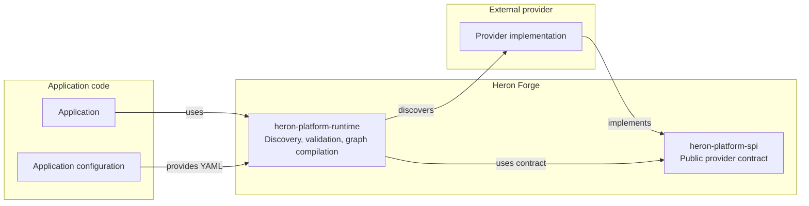
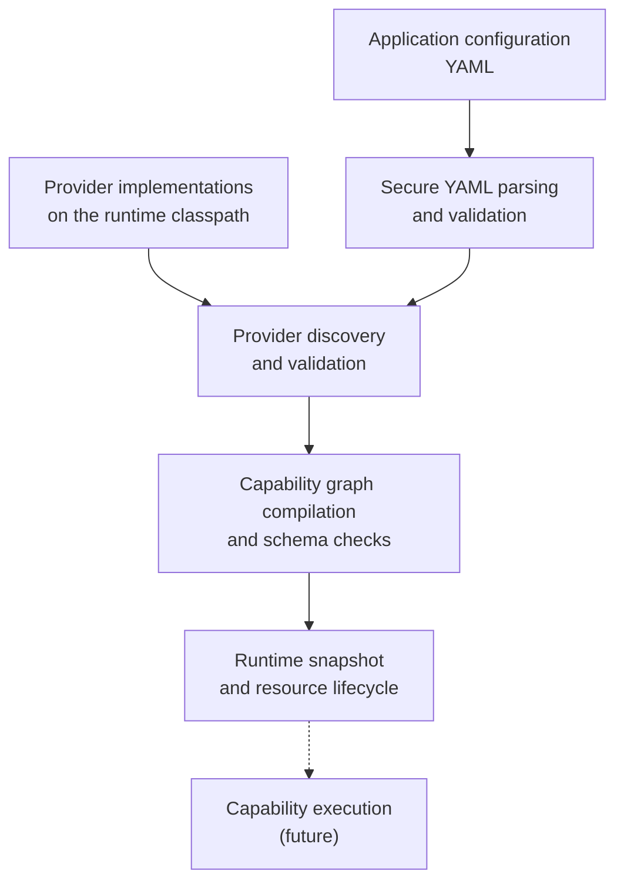

# Heron Forge

Heron Forge is a Java platform for building, discovering, validating, and composing provider-based capabilities.

Providers expose capabilities through an SPI. 
The runtime loads providers, validates application configuration and capability graphs, checks schemas and dependencies and prepares immutable runtime snapshots.

### Architecture



### Runtime flow



The project currently provides a substantial SPI and runtime foundation. The
execution engine, CLI, OpenTelemetry integration, reusable testkit, and
runnable examples are still under development.

## Requirements

- Java 25

## Building

Use the Gradle wrapper (Gradle 9.6.1):

```bash
./gradlew build
./gradlew test
./gradlew check
```

`check` runs the unit tests, static analysis (Checkstyle, PMD, Error Prone),
coverage reporting and coverage gates.

## Modules

| Module                       | Description                                         | Depends on                                                                   |
|------------------------------|-----------------------------------------------------|------------------------------------------------------------------------------|
| `heron-platform-spi`         | Service provider interfaces (framework-independent) | N/A                                                                          |
| `heron-platform-runtime`     | Runtime implementation                              | `heron-platform-spi`                                                         |
| `heron-platform-cli`         | Command-line entry point                            | `heron-platform-runtime` (prod), `heron-platform-testkit` (test)             |
| `heron-platform-testkit`     | Test support / testkit                              | `heron-platform-spi`                                                         |
| `heron-platform-otel`        | OpenTelemetry integration                           | `heron-platform-spi`, OpenTelemetry                                          |
| `examples:external-provider` | Example external provider                           | `heron-platform-spi` (prod), `heron-platform-testkit` (test)                 |
| `examples:factory-demo`      | Example factory demo                                | `heron-platform-runtime`, `heron-platform-cli`, `examples:external-provider` |

## Boundaries

- The core (`spi`, `runtime`, `cli`, `testkit`) is framework-independent.
- `heron-platform-otel` is the only module that pulls in OpenTelemetry.

## Versions & tools

- Gradle 9.6.1 (wrapper)
- Java toolchain 25
- JUnit Jupiter 5.11.4, AssertJ 3.27.7
- Jackson YAML/DataBind 2.19.2
- SLF4J 2.0.16
- OpenTelemetry API/SDK 1.50.0
- Revapi 0.19.1 (SPI module only; compatible with gradle-revapi 1.8.0)
- JMH 1.37 (runtime module only)
- Error Prone 2.50.0
- PMD 7.25.0, Checkstyle 13.6.0, JaCoCo 0.8.15

All versions are declared in `gradle.properties`.

## Revapi (API compatibility)

`heron-platform-spi` is checked for API compatibility with Revapi. Revapi
compares the current SPI public API with a previous `heron-platform-spi`
artifact. This project uses the Gradle plugin `org.revapi:gradle-revapi:1.8.0`,
the analyzer `org.revapi:revapi-java:0.19.1`, and the baseline version
`0.1.0`, all declared in `gradle.properties`.

There is no public baseline repository artifact in this POC, so the Revapi
tasks skip cleanly when no baseline is resolvable. The baseline can instead be
installed locally; no public publication is needed. `revapiAnalyze` generates
the analysis, while `revapi` enforces it as a build check.

The plugin metadata file is `.palantir/revapi.yml`. Plugin 1.8.0 reads that
hard-coded path, and its DSL cannot relocate it. This file is for accepted
intentional breaks and version overrides, not general Revapi analyzer rules.
`config/revapi.json` remains an unused documentation artifact.

To demonstrate the check, publish the unchanged SPI first:

```bash
./gradlew :heron-platform-spi:publishBaselinePublicationToMavenLocal
```

Then make an intentional breaking change to the public SPI API and run:

```bash
./gradlew :heron-platform-spi:revapi
```

Revapi should fail and report the break. Reverting the API change should make
the check pass again.

## License

See [LICENSE](LICENSE).
