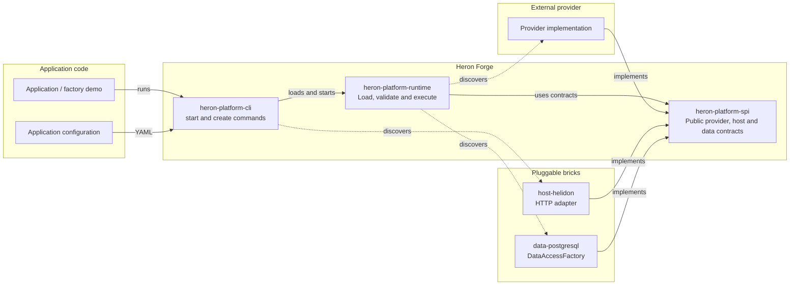
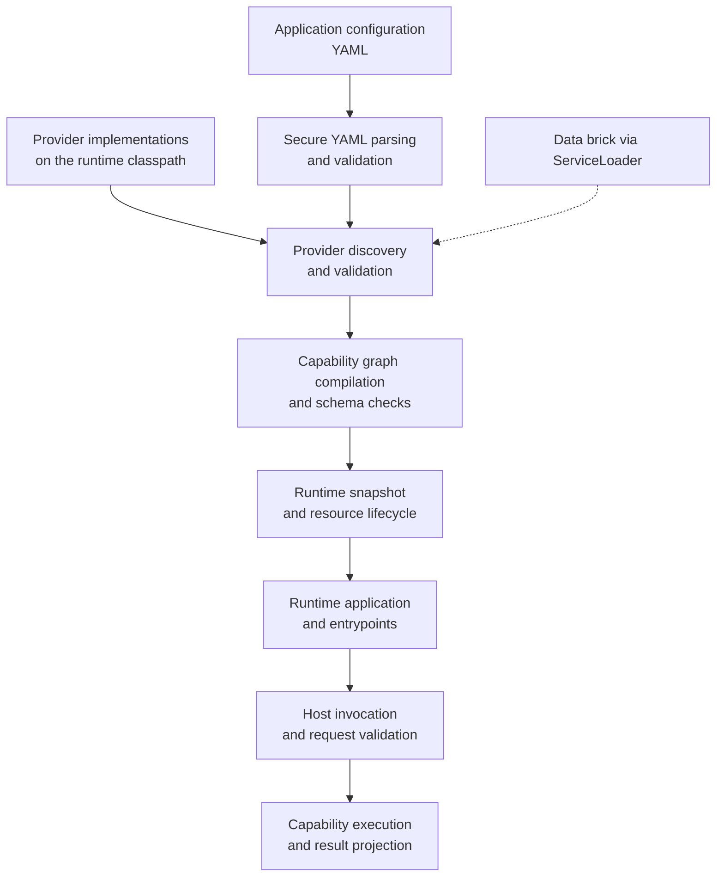

# Heron Forge

Heron Forge is a Java platform for building, discovering, validating, and composing provider-based capabilities.

Providers expose capabilities through an SPI. 
The runtime loads providers, validates application configuration and capability graphs, checks schemas and dependencies and prepares immutable runtime snapshots.

### Architecture



### Runtime flow



## Requirements

- Java 25

## Building

Use the Gradle wrapper (Gradle 9.7.0):

```bash
./gradlew build
./gradlew test
./gradlew check
```

`check` runs the unit tests, static analysis (Checkstyle, PMD, Error Prone), coverage reporting and coverage gates.

## Scaffolding (`heron create`)

The CLI distribution ships a project generator. Build it once:

```bash
./gradlew :bricks:heron-platform-cli:installDist
```

Then scaffold projects from anywhere:

```bash
HERON=bricks/heron-platform-cli/build/install/heron/bin/heron

$HERON create app my-app                       # runnable application starter
$HERON create provider orders --package com.acme.orders   # provider plugin library
$HERON create provider orders --package com.acme.orders --language=KOTLIN  # Kotlin/JVM provider
$HERON create brick pg-store --type=data       # data-access brick skeleton
$HERON create brick web --type=host            # host adapter brick skeleton
```

`heron create` without arguments starts an interactive wizard in a terminal, or prints the direct usage with exit status 2 when no terminal is available.
Project names must match `[a-z][a-z0-9-]*`.
Generated builds resolve `dev.hogwai.platform:heron-platform-*` from `mavenLocal()`, so run `./gradlew publishToMavenLocal` first during the POC phase.
Provider generation defaults to Java. Use `--language=KOTLIN` to generate a Kotlin/JVM provider that implements the Java SPI and registers through `ServiceLoader`.

## Service registration (`@HeronService`)

Services are registered with the `@HeronService` annotation:

```java
@HeronService(value = ProviderFactory.class, id = "demo.orders")
public final class DemoOrdersProviderFactory implements ProviderFactory {
    // ...
}
```

At compile time the `heron-platform-processor` annotation processor generates the `META-INF/services/<interface>` descriptor. 
It also validates the declaration: public non-abstract class with a public no-argument constructor, class implementing the declared contract, non-blank whitespace-free id, canonical `major.minor.patch` version (default `1.0.0`), and unique ids per contract inside a module.

Modules carrying annotated classes must declare the processor on javac's processor path:

```kotlin
dependencies {
    implementation("dev.hogwai.platform:heron-platform-spi:<version>")
    annotationProcessor("dev.hogwai.platform:heron-platform-processor:<version>") // Java
    // kapt("dev.hogwai.platform:heron-platform-processor:<version>")            // Kotlin
}
```

The annotation lives in `core:heron-platform-spi`; the processor is build-time only and never appears in runtime artifacts. 
The runtime discovery mechanism (`ServiceLoader`) is unchanged.

## Factory demo consumer path

The factory demo has one supported consumer path: 
the standard Heron shell and the PostgreSQL fixture supplied by Compose. 
Credentials are never stored in configuration files: the runtime resolves `${HERON_DB_URL}`, `${HERON_DB_USER}` and `${HERON_DB_PASSWORD}` placeholders in `supply-chain.yaml` from the environment.
Start the database, export the connection settings matching the Compose fixture, run the acceptance checks, build the shell distribution, and start the application:

```bash
docker compose -f examples/factory-demo/docker-compose.yml up -d
export HERON_DB_URL=jdbc:postgresql://localhost:5432/heron_demo
export HERON_DB_USER=heron
export HERON_DB_PASSWORD=heron
RUN_POSTGRES_TESTS=true ./gradlew :examples:factory-demo:test
./gradlew :examples:factory-demo:installDist
./examples/factory-demo/build/install/factory-demo/bin/heron start \
  --config examples/factory-demo/src/main/resources/supply-chain.yaml
```

The shell serves `GET /health/ready` and `GET /exceptions` on `http://127.0.0.1:8080`. 
To try a different policy, stop the shell, change `minimumDeliveryRatio` in `supply-chain.yaml` (for example from `0.8` to`0.4`) and start it again. 
Stop the shell with `Ctrl-C`.
Stop PostgreSQL with `docker compose -f examples/factory-demo/docker-compose.yml down`.

`factory-demo` has no `main`, scheduler, retry loop, or custom runner. 
Helidon and picocli are supplied by the standard shell.

`examples:external-provider` contains the Java supply-chain providers. `examples:kotlin-provider` is a separate Kotlin/JVM module containing `demo.kotlin.order-summary`, a PostgreSQL-backed aggregate provider that joins orders and deliveries to expose delivery status and percentage. It uses the `DataAccess` contract, resource tracking, and `ServiceLoader` registration, and is included in `factory-demo` without replacing the Java providers.

## Modules

The platform is split into core modules (agnostic, framework-independent) and bricks (pluggable components that a solution squad wires in).

| Module                                  | Kind    | Description                                                         | Depends on                                                                                                                                                    |
|-----------------------------------------|---------|---------------------------------------------------------------------|---------------------------------------------------------------------------------------------------------------------------------------------------------------|
| `core:heron-platform-spi`               | core    | Service provider interfaces, host contract and data access contract | N/A                                                                                                                                                           |
| `core:heron-platform-runtime`           | core    | Runtime implementation                                              | `core:heron-platform-spi`                                                                                                                                     |
| `bricks:heron-platform-data-jdbi`       | brick   | Generic Jdbi data access engine (connection pooling included)        | `core:heron-platform-spi`                                                                                                                                     |
| `bricks:heron-platform-data-postgresql` | brick   | PostgreSQL dialect over the Jdbi brick (plugin, driver, registration) | `core:heron-platform-spi`, `bricks:heron-platform-data-jdbi`                                                                                                 |
| `bricks:heron-platform-host-helidon`    | brick   | Helidon SE 4.5.3 HTTP shell                                         | `core:heron-platform-spi`                                                                                                                                     |
| `bricks:heron-platform-cli`             | brick   | picocli standard command-line bootstrap                             | `core:heron-platform-spi`, `core:heron-platform-runtime`                                                                                                      |
| `examples:external-provider`            | example | Example external provider                                           | `core:heron-platform-spi`                                                                                                                                     |
| `examples:kotlin-provider`              | example | Kotlin/JVM PostgreSQL-backed provider                               | `core:heron-platform-spi`                                                                                                                                     |
| `examples:factory-demo`                 | example | Example factory demo                                                | `core:heron-platform-runtime`, `bricks:heron-platform-cli`, `bricks:heron-platform-data-postgresql`, `examples:external-provider`, `examples:kotlin-provider` |

## Boundaries

- The core (`spi`, `runtime`) is framework-independent: it knows neither Helidon, nor picocli, nor PostgreSQL.
- The bricks (`data-jdbi`, `data-postgresql`, `host-helidon`, `cli`) are pluggable: a solution squad picks its database brick, its HTTP brick and its launcher.
- The data contract lives in the framework-independent `core:heron-platform-spi`. `bricks:heron-platform-data-jdbi` is the generic SQL engine over Jdbi; `bricks:heron-platform-data-postgresql` is a thin dialect on top of it (PostgresPlugin, JDBC driver) and is discovered by the runtime through `ServiceLoader`. Supporting another database means writing another thin dialect brick.
- The launcher (`bricks:heron-platform-cli`) is host-agnostic: it discovers the `HostAdapter` implementation through `ServiceLoader`. `bricks:heron-platform-host-helidon` is the HTTP brick that a solution squad wires in. Another host brick can be plugged in without touching the launcher.

The runtime discovers the `DataAccessFactory` implementation on the classpath via `ServiceLoader` and supplies it to providers through `BuildContext`. 
A configuration that never touches data access loads even without a data brick; a provider that opens a data client fails with `DATA_ACCESS_UNAVAILABLE` when no brick is present. 
The launcher fails with a clear `HostException` when no host brick is on the classpath. 
A provider opens a data client during creation, registers it in the resource tracker, and receives a fresh database handle for each query. 
The generic Jdbi factory installs no plugins unless they are supplied explicitly, the PostgreSQL factory installs `PostgresPlugin`. 
Both factories run a `SELECT 1` startup probe and sanitize startup and query failures. 
The PostgreSQL factory backs every client with a small HikariCP connection pool (`JdbiPoolOptions.defaults()`, closed together with the client when the snapshot releases it).
Jdbi applies a per-query timeout from the execution deadline; a cancellation signal cannot actively interrupt a server call that is already blocked without a separate statement-cancellation mechanism. 
PostgreSQL integration tests are opt-in with `RUN_POSTGRES_TESTS=true`.

## Versions & tools

- Gradle 9.7.0 (wrapper)
- Java toolchain 25
- JUnit Jupiter 5.11.4, AssertJ 3.27.7
- Jackson Databind 2.21.1; Jackson YAML is test-only
- SnakeYAML Engine 3.1.1
- Jdbi 3.54.0
- Helidon SE 4.5.3
- picocli 4.7.7
- Kotlin/JVM 2.4.10 (generated providers only)
- SLF4J 2.0.16
- Revapi 0.19.1 (SPI module only; compatible with gradle-revapi 1.8.0)
- JMH 1.37 (runtime module only)
- Error Prone 2.50.0
- PMD 7.25.0, Checkstyle 13.6.0, JaCoCo 0.8.15

All versions are declared in `gradle.properties`.

## Revapi (API compatibility)

`heron-platform-spi` is checked for API compatibility with Revapi. 
Revapi compares the current SPI public API with a previous `heron-platform-spi` artifact. 
This project uses the Gradle plugin `org.revapi:gradle-revapi:1.8.0`, the analyzer `org.revapi:revapi-java:0.19.1` and the baseline version `0.1.0`.
 
The baseline can be installed locally. 
`revapiAnalyze` generates the analysis, while `revapi` enforces it as a build check.

To demonstrate the check, publish the unchanged SPI first:

```bash
./gradlew :core:heron-platform-spi:publishBaselinePublicationToMavenLocal
```

Then make an intentional breaking change to the public SPI API and run:

```bash
./gradlew :core:heron-platform-spi:revapi
```

Revapi should fail and report the break. Reverting the API change should make
the check pass again.

## License

See [LICENSE](LICENSE).
